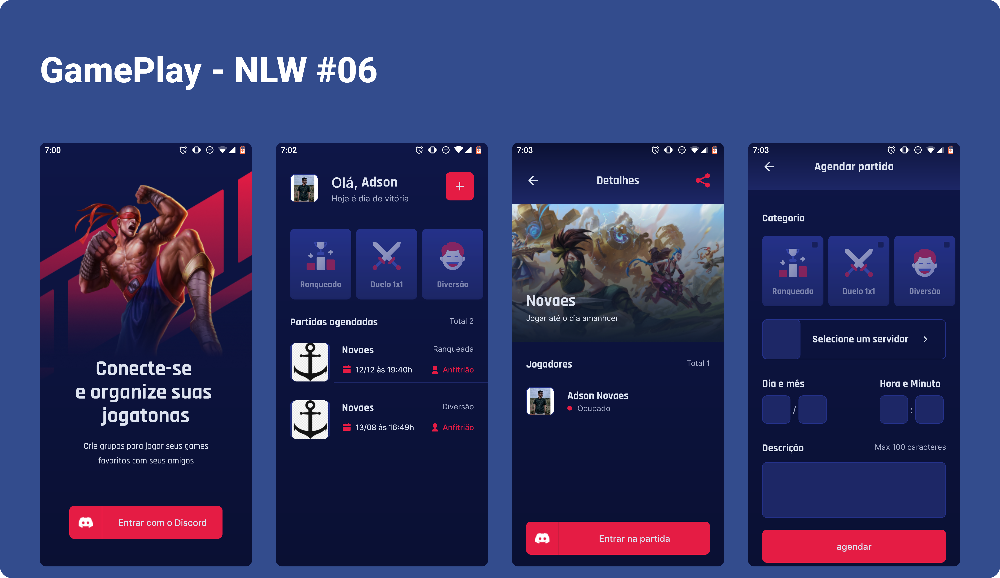

<h1 align="center">
  
</h1>



## 🛠️ Features 

-  Autenticação Social OAuth2 com servidor do Discord.
-  Obtém perfil do usuário cadastro no Discord (username e avatar);
-   Lista os servidores do Discord que o usuário faz parte;
-   Permite realizar o agendamento de partidas;
-   Permite filtrar as partidas por categoria;
-   Exibe se a partida foi agendada em um servidor próprio (anfitrião) ou em servidores de outros (convidado);
-   Compartilha o convite para ingressar no servidor do usuário;
-   Permite redirecionar o usuário para o seu próprio servidor;
-   Disponibiliza a função de Logout.


## ⚙️ Tecnologias

-   React Native
-   Typescript
-   Expo
-   Context API
-   Async Storage
-   Vector Icons
-   React Native Svg e Svg Transform
-   Axios
-   Gradient colors
-   OAuth2 Discord 
-   Expo Google Fonts
-   React Navigation Stack
-   React Native Gesture Handler
-   Expo Authentication
-   React Native Share
-   Deep Link

## Executando o projeto

Utilize o **yarn** ou o **npm install** para instalar as dependências do projeto.
Em seguida, inicie o projeto.

```cl
expo start
```

É importante criar o seu App no servidor do Discord para obter as credencias de autenticação. Em seguida, defina no arquivo .env as configurações do seu App (remova o example do arquivo .env.example).
 
 ```cl
REDIRECT_URI=
SCOPE=
RESPONSE_TYPE=
CLIENT_ID=
CDN_IMAGE=
```
<br />

<div align="center">
  <small>Desenvolvido por Adson da silva Novaes - Janeiro/2022</small>

  [](https://www.instagram.com/adson_novaes/) 
  [](https://www.linkedin.com/in/adson-novaes-99babb205/) 
</div>